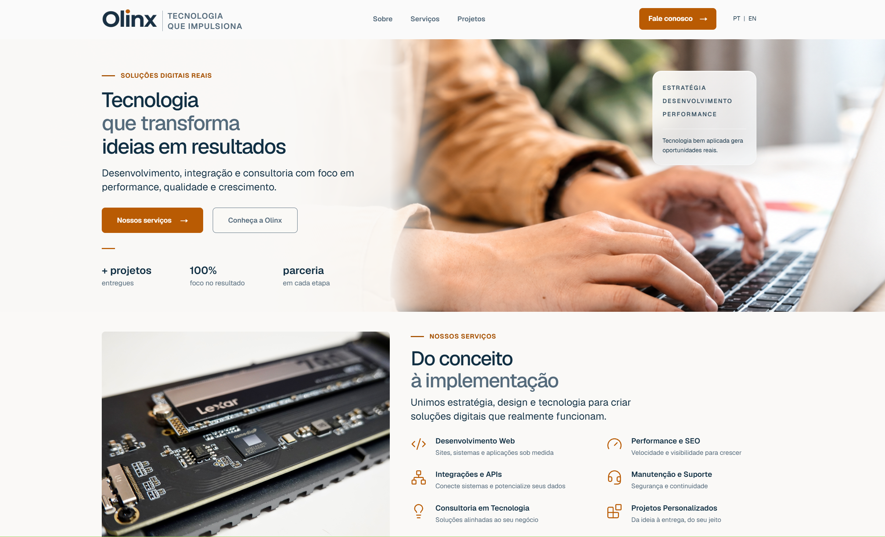
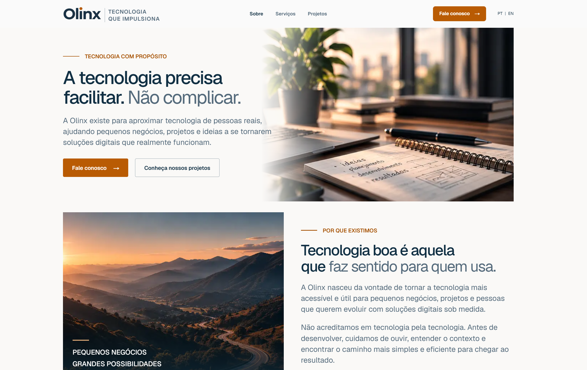
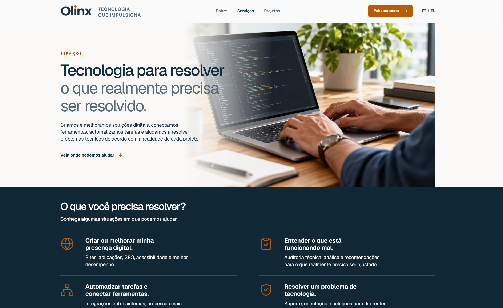
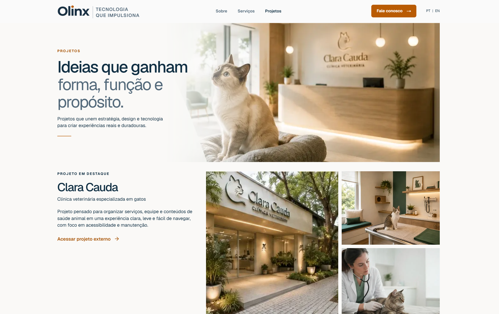
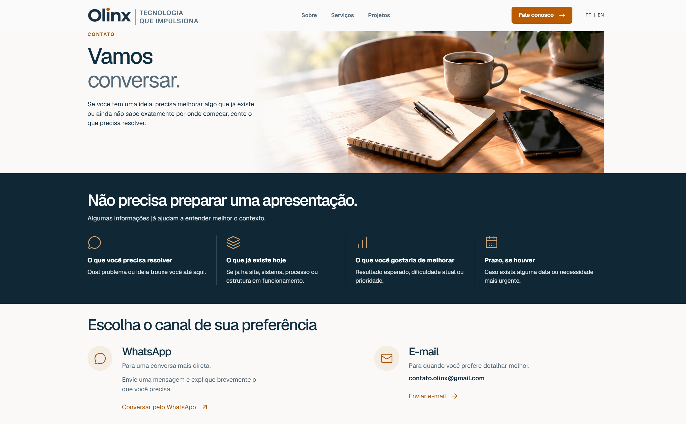
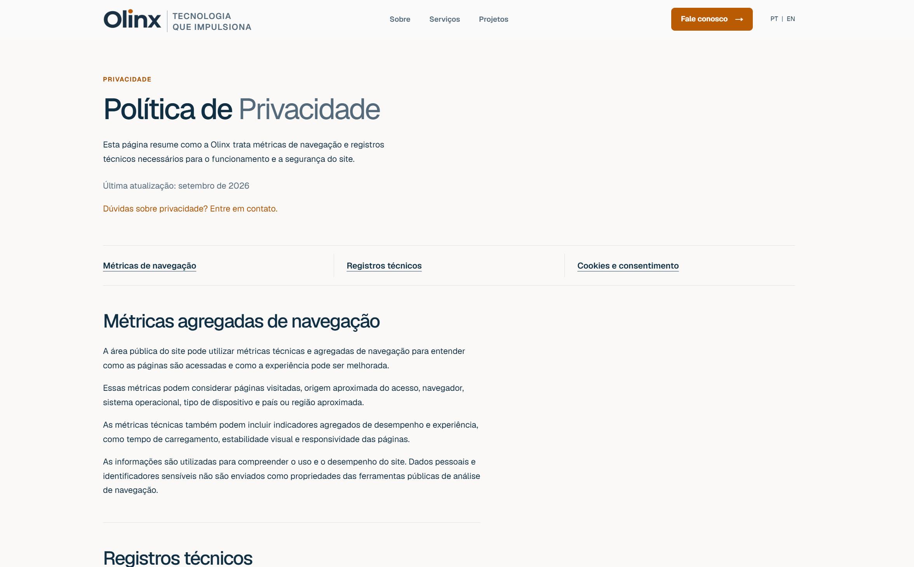
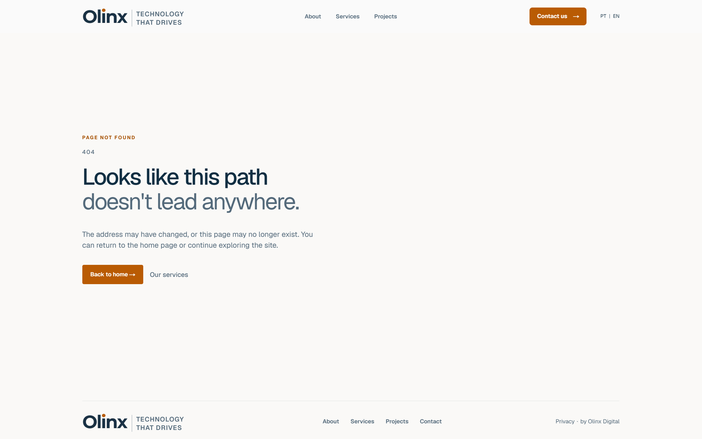

# Olinx Site

Apresentação pública do **Olinx Site**, presença institucional da **Olinx Digital** desenvolvida com Next.js, React e TypeScript.

O projeto combina identidade editorial, conteúdo bilíngue, responsividade, acessibilidade, SEO técnico e uma arquitetura modular preparada para evolução.

<p align="right">
  <a href="https://www.olinx.com.br" target="_blank">
    
  </a>
</p>

> Este repositório apresenta publicamente o projeto e suas principais decisões de produto e engenharia. O código-fonte principal permanece em um repositório privado.

---

## Interface atual

<table>
  <tr>
    <td width="33%"></td>
    <td width="33%"></td>
    <td width="33%"></td>
  </tr>
</table>

---

<table>
  <tr>
    <td width="33%"></td>
    <td width="33%"></td>
    <td width="33%"></td>
  </tr>
</table>

A identidade atual privilegia fundos claros, azul institucional, acentos em laranja, fotografia editorial, tipografia forte e áreas generosas de respiro. A navegação pública usa scroll natural e adapta a composição para desktop, tablet e mobile.

---

## Stack principal

<p>
  
  
  
  
  
  
  
  
</p>

---

## Visão geral

O **Olinx Site** foi desenvolvido como uma presença institucional bilíngue para apresentar a marca, explicar como a Olinx atua, mostrar projetos e oferecer canais diretos de contato.

A implementação atual concentra-se em uma experiência pública clara e acessível, com conteúdo separado da camada visual e componentes compartilhados entre as páginas.

### Páginas públicas

- **Home**
- **Sobre / About**
- **Serviços / Services**
- **Projetos / Projects**
- **Contato / Contact**
- **Privacidade / Privacy**
- **404 e estados de erro personalizados**

O projeto também mantém rotas reservadas para uma futura área de plataforma. Elas são placeholders intencionais, não representam módulos operacionais e não são indexadas.

---

## Desenvolvimento e arquitetura

A base técnica utiliza:

- App Router do Next.js;
- organização modular por feature;
- conteúdo institucional centralizado;
- componentes compartilhados de marketing e UI;
- tokens globais para identidade visual;
- CSS Modules;
- localização PT/EN;
- validação com TypeScript, Vitest e Testing Library.

A arquitetura busca manter baixo acoplamento entre conteúdo, interface e infraestrutura, facilitando manutenção e evolução incremental.

---

## Internacionalização

O site possui experiência equivalente em português e inglês:

- rotas localizadas;
- conteúdo estruturado por locale;
- navegação adaptada ao idioma ativo;
- metadata localizada;
- canonical e alternates/hreflang.

---

## SEO e performance

A implementação pública inclui:

- sitemap;
- robots;
- metadata por página;
- canonical;
- hreflang;
- Open Graph;
- controle de indexação;
- Vercel Analytics;
- Vercel Speed Insights.

---

## Acessibilidade e UX

A experiência considera:

- HTML semântico;
- navegação por teclado;
- foco visível;
- contraste e legibilidade;
- responsividade;
- reflow em telas menores;
- áreas de toque adequadas;
- estados interativos consistentes;
- conteúdo importante disponível diretamente no fluxo da página.

---

## Qualidade

O projeto principal é validado continuamente com:

```bash
npm run typecheck
npm run test
npm run build
```

A suíte cobre conteúdo, componentes de marketing, internacionalização, SEO, segurança, acessibilidade e contratos arquiteturais.

---

## Projeto em produção

**Olinx Digital**  
https://www.olinx.com.br

Contato e demais informações institucionais estão disponíveis diretamente no site.
